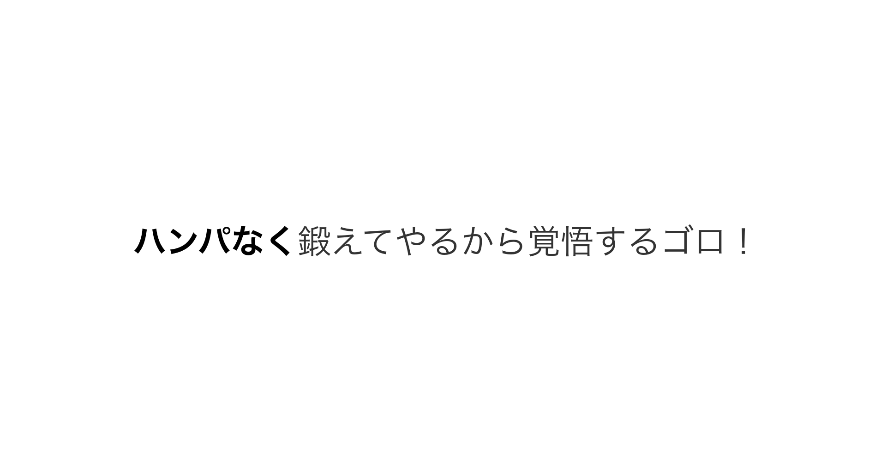
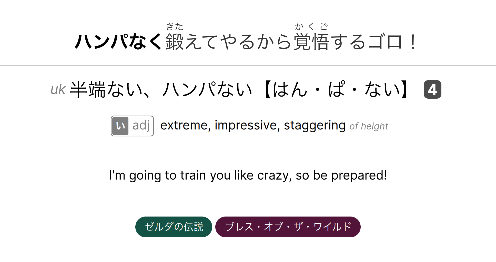

# anki sentence mining template

work in progress

this is an anki card template for sentence mining. it has fields for a foreign
sentence, foreign word reading, translated word and an optional translated
sentence. it has built-in parsers for adding markdown-like styling, furigana
that is visible on either both sides or only on the back side, spoilers,
definition context hints, and word type indicators. it supports a vertical and
horizontal layout, desktop and mobile, as well as light and dark themes.

> animations are now working in desktop Anki >=2.1.62

## example

### input

|Field|Value|
|-|-|
|Complete sentence|`*ハンパなく*[鍛](きた)えてやるから[覚悟](かくご)するゴロ！`|
|Target word reading|`半端ない、ハンパない【はん・ぱ・ない】[4] (uk)`|
|Target word translation|`[い-adj] extreme, impressive, staggering {of height}`|
|Complete sentence translation|`I'm going to train you like crazy, so be prepared!`|
|Tags|`ゼルダの伝説 ブレス・オブ・ザ・ワイルド`|

### output

||||
|-|-|-|
|front|back|clicked sentence, hover tags, and hover reading|

> Having a lot of information on a single card is generally discouraged, so the
> sentence translation, tags and alternate writings are hidden by default and
> can be shown when hovered/clicked.

## set-up

i don't know how to create a teplate deck (if that's even a thing), so these
are instructions to apply to an empty deck.

1. run `make` to generate files (or download from [github
   releases](https://github.com/lonkaars/refold-tools/releases))
2. Under Tools > Manage note types > (note type here) > Fields, make sure the
   following fields exist (might be case-sensitive):
   | |name|description|
   |-|----|-----------|
   |1|Complete sentence|Complete sentence with furigana and target word in bold|
   |2|Target word reading|Dictionary reading of word (with word type)|
   |3|Target word translation|(In context) translation of target word|
   |4|Complete sentence translation|Complete sentence translation|
3. In the 'Browse' view, click on Cards... (you might need to create a
   temporary card in a deck) and paste the contents of front-template.html and
   back-template.html in the front template and back template of the card type.
4. You can add any custom styles you want in the Styling tab, but I recommend
   you remove the default CSS.
5. Profit

This card template is also compatible with AnkiDroid, but you need to add
`.night_mode { }` to the Styling tab for this to work. For some reason
AnkiDroid checks if the card has dark mode 'support' by checking if the Styling
tab CSS contains the literal string `.night_mode`. [The
documentation](https://docs.ankiweb.net/templates/styling.html#night-mode)
suggests that the night mode CSS class is called `nightMode` instead of
`night_mode`, but `night_mode` works fine on desktop too, so is used in this
card template.

## syntax

parsing behavior is controlled using html classes. if two parsers check for the
same character, they likely cannot be used simultaneously. here are the default
classes for this template:

|card field|classes|
|-|-|
|sentence|[`parse`](#parse) [`parse-furigana`](#parse-furigana) [`parse-format`](#parse-format) [`foreign`](#foreign)|
|target word reading|[`parse`](#parse) [`parse-format`](#parse-format) [`parse-reading`](#parse-reading) [`parse-indicators`](#parse-indicators) [`parse-script`](#parse-script) [`foreign`](#foreign)|
|target word translation|[`parse`](#parse) [`parse-format`](#parse-format) [`parse-definitions`](#parse-definitions) [`parse-indicators`](#parse-indicators) [`parse-script`](#parse-script) [`native`](#native)|
|sentence translation|[`parse`](#parse) [`parse-format`](#parse-format) [`native`](#native) [`spoiler`](#spoiler) [`parse-script`](#parse-script) [`hidden`](#hidden)|
|tags|[`parse`](#parse) [`parse-tags`](#parse-tags)|

### parse

enables parsing for element. if a parser has a character sensitivity list, a
backslash can be used to insert the literal character instead.

### parse-format

parse bold and italic style, and convert `\n` and `\t` into newline and tab
characters.

examples:

|input|output|
|-|-|
|`*bold*`|<b>bold</b>|
|`_italic_`|<i>italic</i>|
|`\t`|(literal tab character)|
|`\n`|html ` `|

sensitive to the following characters: `*_`

### parse-furigana

parse furigana between square or curly brackets immediately followed by reading
between parenthesis.

examples:

|input|output|
|-|-|
|`[漢字](かんじ)`|<ruby>漢字<rt>かんじ</rt></ruby> (furigana visible on back side only)|
|`{漢字}(かんじ)`|<ruby>漢字<rt>かんじ</rt></ruby> (furigana visible on both sides)|

sensitive to the following characters: `{}`

### parse-definitions

parse list of latin definitions separated by commas, or japanese definitions
separated by japanese full stop, and convert text between curly brackets to
subtile text. commas/full stops do not start a new definition inside subtile
text and parenthesis, and are inserted normally.

example:

|input|output|
|-|-|
|`word {subtile, or is it} (this is, a single item)\, and still is here, but not here`|<ul><li>word <i style="font-size: 70%">subtile, or is it</i> (this is, a single item), and still is here</li><li>but not here</li></ul>|
|`単語定義１。定義２。`|<ul><li>単語定義１。</li><li>定義２。</li></ul>|

in desktop horizontal, desktop vertical, and mobile horizontal layouts,
definitions are displayed on a single line, separated by a comma. in the
vertical mobile layout, items are separated by a short bar, and displayed in a
vertical list.

sensitive to the following characters: `{}(),。`

### parse-indicators

parse indicators between square brackets. indicator "stamp" can be added by
suffixing the stamp with a dash character.

examples:

|input|output|
|-|-|
|`[adj]`||
|`[な-adj]`||
|`[な\-adj]`||

sensitive to the following characters: `[]-`

### parse-reading

parse reading field. start of input is tagged with class `kanji`, everything
between lenticular brackets is tagged with class `reading`, note can be added
with regular parenthesis (for marking if word is usually written as kanji),
pitch accent index can be added using square brackets. if a word is commonly
written in multiple ways, they can be separated by a japanese comma.

example (+1 marker expands to other readings when hovered/tapped):

|input|output|
|-|-|
|`半端ない、ハンパない【はん・ぱ・ない】[4] (uk)`||

sensitive to the following characters: `【】()・、` (and line start)

### parse-script

parse text into `span` elements with class `script-japanese` or `script-latin`
when a script switch is detected. used for forcing non-italic fonts for
japanese text

### parse-tags

used on tags element only. separates tags by space.

### foreign

mark element as having foreign (japanese) text by default (slightly larger font
size for lcd's)

### native

mark element as having native (latin) text by default (default font size)

### spoiler

enables spoiler behavior for element (requires [`parse`](#parse) class to work)

### hidden

set element with [`spoiler`](#spoiler) class to be hidden by default

### visible

set element with [`spoiler`](#spoiler) class to be visible by default

