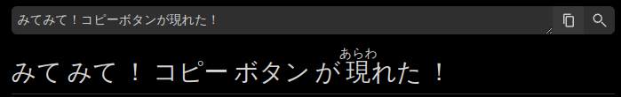
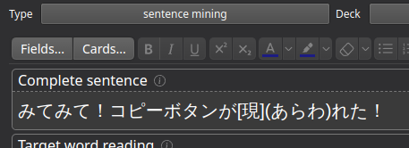
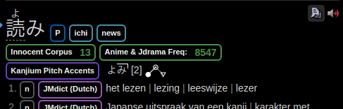
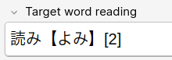
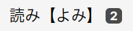

# yomichan stuff (OBSOLETE)

this is a folder containing yomichan stuff

all .js and .css files in conf.d get minified into user.min.js and
user.min.css, and can be pasted into yomichan (with [user script
patch](../yomichan/readme.md))

## sentence export

adds an export button to the search bar for copying a sentence with furigana
into [my custom anki card template](../anki-card-template/readme.md).

## word export

adds a copy button to each definition for copying into [my custom anki card
template](../anki-card-template/readme.md). (Should) automatically insert
interpuncts, add pitch accent downfall step (if available), and marker if word
is usually written as kana only. <kbd>Alt</kbd>+<kbd>C</kbd> to copy currently
selected entry.

  
  

## shortcuts

adds the following shortcuts to yomichan:

|shortcut|action|
|-|-|
|<kbd>Alt</kbd>+<kbd>J</kbd>|select next definition (move down)|
|<kbd>Alt</kbd>+<kbd>K</kbd>|select previous definition (move up)|
|<kbd>Alt</kbd>+<kbd>G</kbd>|scroll back to top|

