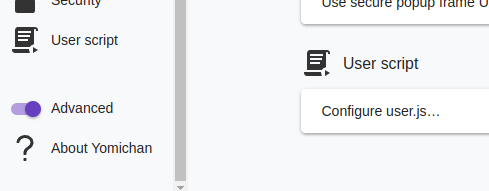

# yomichan patch stuff (OBSOLETE)

adds a user.js script to your config and settings page that runs in the search
page and popup window.



## set-up

to download the latest yomichan version and patch it, leaving all files exposed
for later updating (unpacked extension), run the following command:

> updating is currently broken, so you have to run `make clean` before `make
> patch` to prevent the .html.patch files from being applied twice

```
make patch
```

to patch yomichan and convert it back to a zip (packed extension, non-signed,
for use with kiwi browser), run:

```
make yomichan-chrome-patched.zip
```

if you want to update the patch or zip, replace `make` with `make -B`.
